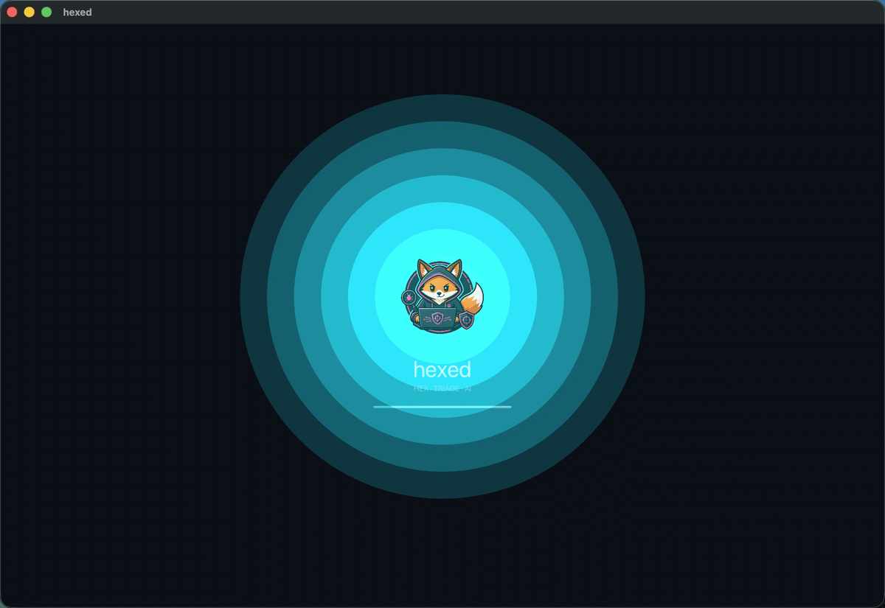
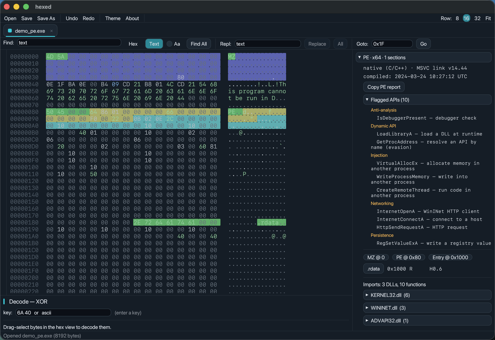
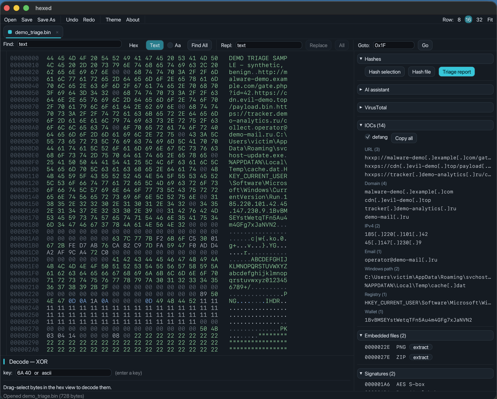

# hexed 🦊

<p align="center">
  
</p>

**A hex editor built for threat analysts.** Written in Rust + [egui](https://github.com/emilk/egui).

Open a suspicious file and hexed immediately works it up: it parses the PE, **extracts and defangs IOCs**, **flags dangerous imports** by capability, **finds embedded payloads and crypto constants**, and gives you a **one-click triage report** — all without leaving the byte view. It borrows good ideas from 010 Editor, ImHex, and HxD, but the workflow is tuned for *triage*: open → understand → pivot → write a rule.

> Defensive / research tool. It only ever **reads** the bytes you point it at — it never executes a sample.

---

## Built for threat analysts

The triage panels light up the moment a file loads — no config, no scripting.

| Capability | What you get |
|---|---|
| **IOC extraction** | URLs, domains, IPv4, emails, Windows/Unix paths, registry keys, and BTC/ETH wallets — pulled from ASCII **and** UTF‑16 strings, de‑duplicated, each **click‑to‑jump** to its offset. One‑click **defang** (`hxxp://`, `1[.]2[.]3[.]4`) and **copy‑all**. |
| **Suspicious API flagging** | Imported Win32 APIs grouped by capability — **Injection** (`VirtualAllocEx`, `WriteProcessMemory`, `CreateRemoteThread`), **Persistence**, **Anti‑analysis** (`IsDebuggerPresent`), **Networking** (`connect`/`recv`/`bind` → possible backdoor), **Crypto** (ransomware tells), and more. |
| **Embedded‑file carving** | Scans for hidden payloads by magic — appended/resource **PE**, **ZIP/GZIP/7z/RAR**, **PNG/JPEG/PDF**, **ELF/Mach‑O** — `MZ` validated through to `PE\0\0`. Click to jump, or **extract to a new tab**. |
| **Crypto & packer signatures** | Detects **AES S‑box**, SHA‑256/MD5/SHA‑1 constants, CRC‑32 tables, base64 alphabets, and **UPX** markers — often the fastest route to the decryptor. |
| **imphash + section hashes** | pefile‑compatible **imphash** for pivoting on VirusTotal, plus per‑section MD5 and entropy. |
| **One‑click triage report** | A full Markdown report — hashes, imphash, entropy, PE summary, flagged APIs, IOCs, embedded files, signatures (plus the VirusTotal verdict when enrichment is on) — copied to your clipboard, ready to paste into a ticket or blog. |
| **YARA rule library** | Keep a folder of your YARA rules; every file you open is **auto‑scanned against all of them** and matches surface immediately, each **click‑to‑jump** to the matched bytes. Save a generated rule straight into the library. |
| **VirusTotal** *(opt‑in)* | Toggle **by‑hash** enrichment: looks up the file's SHA‑256 to show detection ratio + family label — **never uploads** the sample. Also pivots on the PE's **icon** (`main_icon_dhash`) to tell you how many files share it (unique lure vs. common family), and an "Open in VT" button. Off by default (a hash lookup still tells VT). |
| **AI assist** *(optional)* | Bridges to the `codex` CLI to explain a selection, draft a YARA rule, identify a cipher and decode it, or produce an ATT&CK‑mapped triage write‑up. |

<p align="center">
  
  <br><em>A PE loaded: the header is colour‑mapped, the PE navigator lists sections, and <strong>Flagged APIs</strong> groups suspicious imports — injection, anti‑analysis, networking, persistence.</em>
</p>

<p align="center">
  
  <br><em>The <strong>IOCs</strong> panel: indicators grouped by type, defanged, click‑to‑jump — with the accent <strong>Triage report</strong> button one click away.</em>
</p>

### Example triage report

Running the built‑in report over the bundled [`examples/demo_triage.bin`](examples/demo_triage.bin) (a safe, synthetic sample):

```markdown
# Triage — demo_triage.bin

- size: 728 bytes
- MD5: … · SHA-256: …
- entropy: 3.1 bits/byte

## IOCs (14) — defanged
### URL (3)
- hxxp://malware-demo[.]example[.]com/gate.php?id=42
- hxxps://cdn[.]evil-demo[.]top/payload.bin
- hxxps://tracker[.]demo-analytics[.]ru/collect
### Domain (4)
- malware-demo[.]example[.]com, cdn[.]evil-demo[.]top,
  tracker[.]demo-analytics[.]ru, demo-mail[.]ru
### IPv4 (2)      → 185[.]220[.]101[.]42, 45[.]147[.]230[.]9
### Email (1)     → operator@demo-mail[.]ru
### Registry (1)  → HKEY_CURRENT_USER\Software\Microsoft\Windows\CurrentVersion\Run
### Windows path (2), Wallet (1) → 1BvBMSEYstWetqTFn5Au4m4GFg7xJaNVN2

## Embedded files (2)
- 0x22E  PNG
- 0x27E  ZIP

## Signatures (2)
- 0x1A6  AES S-box — Rijndael forward S-box (AES)
- 0x1D6  Base64 alphabet
```

---

## Also a capable hex editor

**Viewing & navigation**
- Virtualized hex + ASCII grid (opens multi‑hundred‑MB files instantly), byte‑value colour coding, **4 switchable themes**, and a launch splash
- **Hex / Text view toggle** — flip the central pane between the hex grid and a line‑based **text view** (byte‑offset gutter, click a line to place the caret), like 010 Editor
- **Tabs** — many files at once; each keeps its own selection, strings, hashes, search, and decode state; drag‑and‑drop to open
- **Entropy strip** down the gutter (blue → red) to spot packed/encrypted regions at a glance
- **Search** — hex pattern with `??` wildcards or text; **Goto (⌘G)**; click any string, IOC, section, or signature to jump to it

**Decode & transform** (the core RE loop)
- **XOR** with a repeating hex/ASCII key and a **live decode preview** — strings fall out as you type the key
- **Single‑byte brute force** — ranks all 256 keys by how much the output looks like text
- **Block transforms** (undoable): NOT, NEG, +1, −1, ROL, ROR, Reverse, ByteSwap16/32
- Insert/delete/resize with unlimited undo/redo

**Structure & analysis**
- **Data inspector** — int/uint 8–64, float32/64, `time_t`, Windows `FILETIME`, LE/BE, multi‑base converter
- **PE navigator** — sections with offsets, RWX perms, per‑section entropy (>7.0 flagged), imports/exports, and **embedded‑icon extraction**
- **`.bt` binary templates** — a 010‑style template engine with a colour‑coded result tree and click‑to‑jump nodes
- **Strings** (ASCII + UTF‑16), **byte histogram**, **x86 disassembly**, **binary diff/compare**, **bookmarks**
- **Hashes** — CRC‑32 / MD5 / SHA‑1 / SHA‑256 of selection or file

**Export / carving**
- Copy selection as Hex, Text, **YARA hex** (`{ 6A ?? 40 }`), C array, or base64 (right‑click → "Copy As")
- **YARA** — generate a rule from a sample, scan the buffer, and keep a **rule library** that auto-scans every file you open (matches show up with click-to-jump to the matched bytes)
- Carve any selection — or a detected embedded file — into a new tab or to disk

---

## Installation

### Prerequisites
- A recent stable **Rust** toolchain — install with [rustup](https://rustup.rs).
- **macOS** with **Xcode** or the Command Line Tools (`xcode-select --install`) — the `yara-x` / `wasmtime` dependencies compile some C. hexed is developed and tested on macOS (Apple Silicon); it's a portable Rust + [egui](https://github.com/emilk/egui) app, but the `.app` bundling and Finder "Open With" are macOS‑specific.

### 1 · Get the code
```sh
git clone https://github.com/ashley-920/hexed.git
cd hexed
```

### 2 · Build & run from source
```sh
cargo run --release -p hexed                  # empty editor
cargo run --release -p hexed -- sample.bin    # open a file
cargo run --release -p hexed -- a.exe b.dll   # several files → tabs
cargo test                                    # run the test suite
```
> The first build compiles the yara‑x/wasmtime C bits and takes a few minutes; later builds are fast.

### 3 · Install as a macOS app  *(recommended)*
```sh
./scripts/make-macos-app.sh --install
```
Builds a release binary, bundles **Hexed.app**, ad‑hoc code‑signs it (so Gatekeeper lets it run), and copies it to `/Applications`. It then appears in Spotlight/Launchpad, and you can **right‑click any file in Finder → Open With → Hexed** — it registers as an *alternate* handler (`LSHandlerRank=Alternate`), so it never becomes a default or changes your file associations. Omit `--install` to just build the bundle under `target/release/`.

### Configuration *(optional)*
- **VirusTotal** — put your VT API key in `~/.hexed_vt_key` (or set `$VT_API_KEY`), then toggle **Enrichment** on in the VirusTotal panel. Lookups are by‑hash only and off by default; the key stays local and is never committed.
- **YARA library** — drop `.yar` rules in `~/.hexed_yara_templates/` (or use the YARA panel's *Save to library* / *Add…*) to auto‑scan every file you open.
- **SDK path** — `.cargo/config.toml` pins `SDKROOT` to Xcode's SDK for the C build. If yours is elsewhere, set it to `xcrun --show-sdk-path`, or delete the file if `cc` already finds it.

---

## Keyboard shortcuts

| Shortcut | Action | Shortcut | Action |
|---|---|---|---|
| ⌘O | Open file (new tab) | ⌘Z / ⌘⇧Z | Undo / Redo |
| ⌘S / ⌘⇧S | Save / Save As | ⌘G | Goto address |
| ⌘W | Close tab | ⌘B | Bookmark caret |

---

## Architecture

A strict split keeps the core reusable (and fully unit‑tested):

```
hexed/
├─ crates/hexed-core/   # UI-agnostic logic, 80+ tests
│  ├─ ioc / carve / signatures   # triage: IOCs, embedded files, crypto constants
│  ├─ pe                         # PE parser + imphash + suspicious-API flagging
│  ├─ xor / ops / search         # decode, block transforms, hex-wildcard search
│  ├─ strings / entropy / hashes / histogram / inspect / diff / export
├─ crates/hexed-bt/     # the 010-style .bt binary-template engine
└─ app/                 # egui/eframe shell (thin; all logic lives in core)
```

## License

MIT — see [LICENSE](LICENSE). A defensive research tool; use it on samples you're authorized to analyze.

---

<sub>The fox is doing threat research, not committing crimes. 🦊🔍</sub>
